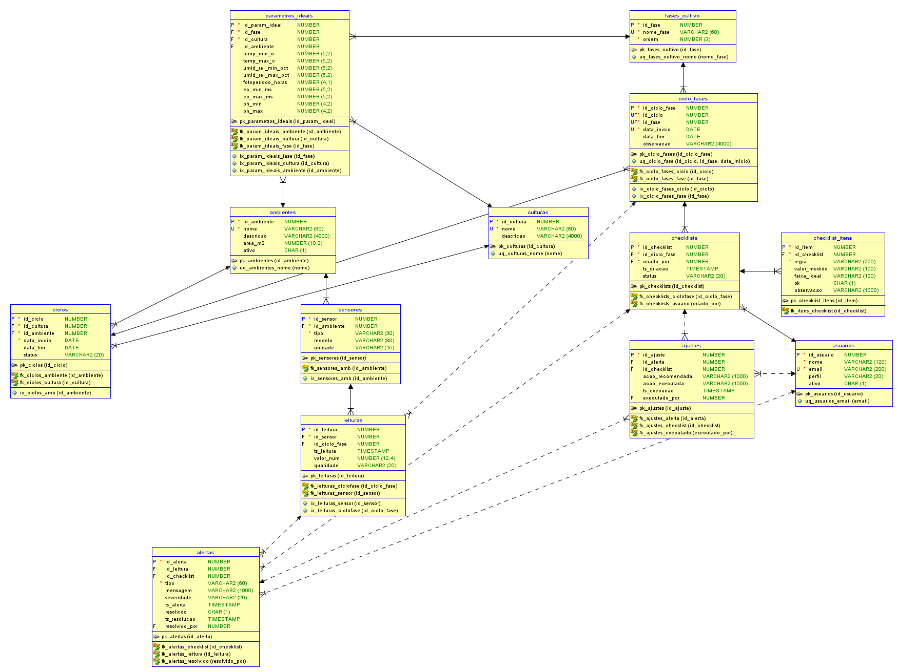

# 🌱 Enterprise Challenge - Sprint 3

FIAP - Faculdade de Informática e Administração Paulista  
Aluno: THOMAZ REQUENA
RM: 563956
---

## 📘 Descrição do Projeto
Este repositório contém a entrega da **Sprint 3** do **Enterprise Challenge**, cujo foco é o desenvolvimento de um **sistema de apoio ao cultivo indoor** com monitoramento, checklist inteligente e trilha de auditoria.  

O projeto foi implementado em **Python** e integrado a um **banco de dados Oracle**, com modelagem relacional e scripts de inserção de dados sintéticos.

---

## 🎯 Objetivos
- Criar um **banco de dados relacional** robusto para suportar o ciclo de cultivo.  
- Implementar **scripts de povoamento sintético** (>= 500 registros em todas as tabelas).  
- Garantir **consistência referencial** entre as tabelas (usuários, ambientes, culturas, ciclos, sensores, leituras etc).  
- Suportar consultas para **monitoramento de parâmetros**, **validação por checklist** e **alertas automáticos**.  
- Entregar **trilha de auditoria** com histórico de ajustes aplicados.

---

## 🗃️ Modelo de Dados (ER)
O diagrama abaixo mostra as principais entidades e relacionamentos utilizados:



**Principais entidades:**
- `usuarios` – operadores/admins do sistema  
- `ambientes` – estufas/boxes de cultivo  
- `culturas` – espécies/variedades cultivadas  
- `fases_cultivo` – germinação, vegetativo, floração, colheita  
- `parametros_ideais` – limites por fase + cultura + ambiente  
- `ciclos` – cultivo em execução  
- `ciclo_fases` – linha do tempo do ciclo  
- `sensores` – cadastro de dispositivos de leitura  
- `leituras` – telemetria dos sensores  
- `checklists` & `checklist_itens` – verificações automáticas/manuais  
- `alertas` – eventos críticos de monitoramento  
- `ajustes` – histórico de ações corretivas  

---

## ⚙️ Tecnologias Utilizadas
- **Python 3.x**
  - [oracledb](https://python-oracledb.readthedocs.io) (conexão com Oracle)
  - `random`, `datetime` (geração de dados sintéticos)
- **Oracle Database 19c/21c**
  - Modelagem relacional
  - Constraints, chaves estrangeiras e integridade referencial
- **SQL Developer / SQL Data Modeler**
  - Criação e visualização do modelo ER
  - Execução de DDL e DML

---

## ▶️ Como Executar
1. Clone o repositório:
   ```bash
   git clone https://github.com/thomazrequena/Enterprise-Challenge-Sprint-3-.git
   cd Enterprise-Challenge-Sprint-3-
